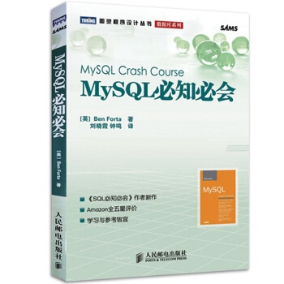

# 《MySQL必知必会》导读




- [导读](https://github.com/Huang-Libo/MySQL_Crash_Course)
- [样例表说明及详情](https://github.com/Huang-Libo/MySQL_Crash_Course/blob/master/tables.md)

## 书籍相关资源

书籍配套网站：https://forta.com/books/0672327120/  
样例表和填充脚本：https://github.com/Huang-Libo/MySQL_Crash_Course/tree/master/mysql_scripts  
( 或直接从官网下载： https://forta.com/wp-content/uploads/books/0672327120/mysql_scripts.zip )  

## 环境

macOS 10.15.x


## 先安装 brew

在命令行输入 `brew`，若提示 command not found，则先安装它：

```
/usr/bin/ruby -e "$(curl -fsSL https://raw.githubusercontent.com/Homebrew/install/master/install)"
```

（ 详情可看其官网：https://brew.sh ）

## 安装 MySQL

检索 mysql 相关信息：

```
brew info mysql
brew search  mysql
```

如果无问题，则可以开始安装：

```
brew install mysql
```

安装完成后，会有下面的提示：

```
We've installed your MySQL database without a root password. To secure it run:
    mysql_secure_installation

MySQL is configured to only allow connections from localhost by default

To connect run:
    mysql -uroot

To have launchd start mysql now and restart at login:
  brew services start mysql
Or, if you don't want/need a background service you can just run:
  mysql.server start
```

## 初始设置

执行 `mysql_secure_installation`，给数据库管理员设置密码等：

```
➜  ~ mysql_secure_installation

Securing the MySQL server deployment.

Enter password for user root:

VALIDATE PASSWORD COMPONENT can be used to test passwords
and improve security. It checks the strength of password
and allows the users to set only those passwords which are
secure enough. Would you like to setup VALIDATE PASSWORD component?

Press y|Y for Yes, any other key for No: n
Using existing password for root.
Change the password for root ? ((Press y|Y for Yes, any other key for No) : y

New password:

Re-enter new password:
By default, a MySQL installation has an anonymous user,
allowing anyone to log into MySQL without having to have
a user account created for them. This is intended only for
testing, and to make the installation go a bit smoother.
You should remove them before moving into a production
environment.

Remove anonymous users? (Press y|Y for Yes, any other key for No) : y
Success.


Normally, root should only be allowed to connect from
'localhost'. This ensures that someone cannot guess at
the root password from the network.

Disallow root login remotely? (Press y|Y for Yes, any other key for No) : y
Success.

By default, MySQL comes with a database named 'test' that
anyone can access. This is also intended only for testing,
and should be removed before moving into a production
environment.


Remove test database and access to it? (Press y|Y for Yes, any other key for No) : y
 - Dropping test database...
Success.

 - Removing privileges on test database...
Success.

Reloading the privilege tables will ensure that all changes
made so far will take effect immediately.

Reload privilege tables now? (Press y|Y for Yes, any other key for No) : y
Success.

All done!
```

完成后即可登录：

```
mysql -uroot -p
```

显示所有数据库：

```
mysql> show databases;
```

## mysql 服务的启动

如果想随系统启动：  

```
brew services start mysql
```

如果不想设为随系统启动，可在需要时手动启动：

```
mysql.server start
```

## 样例表及其填充

#### 六张表的说明

附录 `B.1` 需要仔细读。

#### 创建数据库

先创建一个新的数据库：

```
mysql> create database mysql_crash_course;
```
选择要操作的数据库：

```
mysql> use mysql_crash_course;
```

查看所有表：

```
mysql> show tables;
```

由于当前数据库是空的，会显示：

```
Empty set (0.01 sec)
```

#### 使用脚本创建六张表

如果 `mysql_scripts` 是放在了 `Downloads` 目录，则在 mysql 里执行：

```
mysql> source ~/Downloads/mysql_scripts/create.sql
```

再查看所有表：

```
mysql> show tables;
```

就可以看到这六张表了：

```
+------------------------------+
| Tables_in_mysql_crash_course |
+------------------------------+
| customers                    |
| orderitems                   |
| orders                       |
| productnotes                 |
| products                     |
| vendors                      |
+------------------------------+
6 rows in set (0.00 sec)
```

#### 使用脚本向六张表中填充数据

```
source ~/Downloads/mysql_scripts/populate.sql
```

查看 `customers` 表：

```
mysql> select *
    -> from customers;
```

输出结果：

```
+---------+----------------+---------------------+-----------+------------+----------+--------------+--------------+---------------------+
| cust_id | cust_name      | cust_address        | cust_city | cust_state | cust_zip | cust_country | cust_contact | cust_email          |
+---------+----------------+---------------------+-----------+------------+----------+--------------+--------------+---------------------+
|   10001 | Coyote Inc.    | 200 Maple Lane      | Detroit   | MI         | 44444    | USA          | Y Lee        | ylee@coyote.com     |
|   10002 | Mouse House    | 333 Fromage Lane    | Columbus  | OH         | 43333    | USA          | Jerry Mouse  | NULL                |
|   10003 | Wascals        | 1 Sunny Place       | Muncie    | IN         | 42222    | USA          | Jim Jones    | rabbit@wascally.com |
|   10004 | Yosemite Place | 829 Riverside Drive | Phoenix   | AZ         | 88888    | USA          | Y Sam        | sam@yosemite.com    |
|   10005 | E Fudd         | 4545 53rd Street    | Chicago   | IL         | 54545    | USA          | E Fudd       | NULL                |
+---------+----------------+---------------------+-----------+------------+----------+--------------+--------------+---------------------+
5 rows in set (0.01 sec)
```

如果要退出 MySQL：

```
mysql> quit;
```

## 使用 mycli 自动补全

> 没有自动补全很难受。

`mycli` 官网：https://www.mycli.net/  

安装 `mycli`：  

```
brew install mycli
```

使用 `mycli` 连接：

```
mycli -h localhost -u root
```

使用 `tab` 键就可以自动补全了。  

## mycli 打开多行模式

mycli 默认没有多行模式，需要配置：

```
vim ~/.myclirc 
```    

找到 multi_line 并将其改为 True：  

```
8 # Multi-line mode allows breaking up the sql statements into multiple lines. If  
9 # this is set to True, then the end of the statements must have a semi-colon.    
10 # If this is set to False then sql statements can't be split into multiple       
11 # lines. End of line (return) is considered as the end of the statement.         
12 multi_line = True
```

接下来就可以愉快地玩耍了。 

## 图形界面推荐

Navicat

## 章节说明

`第4章`至`第9章`：基础查询。  
`第10章`至`第18章`：进阶的查询。  
`第19章`至`第21章`：增删改等操作。  
`第22章`至`第30章`：高级特性。  


